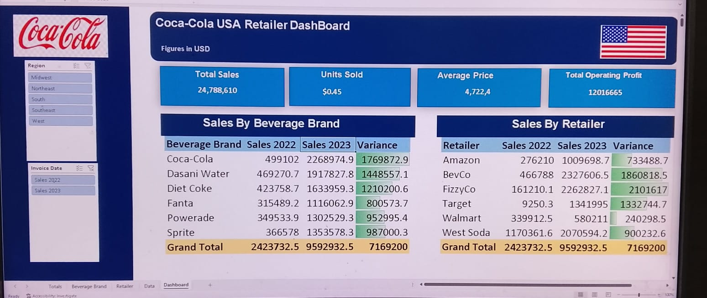

📊 Coca-Cola USA Retailer Sales Dashboard

📌 Project Overview

This is an interactive Coca-Cola USA Retailer Sales Dashboard built using Microsoft Excel to monitor and analyze sales performance across beverage brands, retailers, and regions.
It also provides a  clear comparison of Sales (2022 vs 2023), highlights performance variance across years and tracks the overall profitability using structured KPIs.

🛠 Tools & Skills Used
• Microsoft Excel
• Pivot Tables
• Pivot Charts
• Slicers
• KPI Cards
• Variance Analysis (Year-over-Year Comparison)
• Data Cleaning & Transformation
• Conditional Formatting (Data Bars)
• Excel 365 Dashboard Features

📈 Key Insights
•Identified top-performing beverage brand based on the sales growth.
•Analyzed retailer-wise contribution to total revenue.
•Evaluated year-over-year sales growth using variance analysis.
•Compared brand performance across multiple regions using slicers.

This project improved my expertise in building interactive Excel dashboards and strengthened my ability to transform raw sales data into meaningful business insights.

## 🖼 Dashboard Preview

